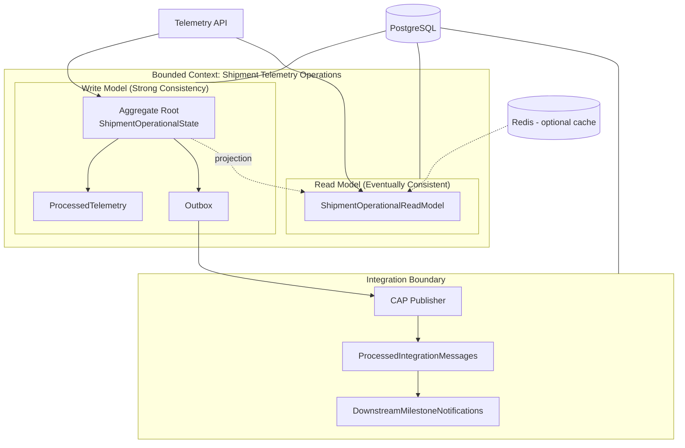

# Context & Aggregate Consistency Boundary

## Consistency Rules

- **Single transaction** commits: operational state, processed telemetry, outbox, read model, telemetry status.
- **Aggregate version** (`uint Version`) provides optimistic concurrency on `ShipmentOperationalState`.
- **Unique indexes** enforce idempotency (`EventId`) and sequence ownership (`ContainerId + SequenceNumber`).
- Redis cache is invalidated after successful writes; PostgreSQL remains authoritative.
