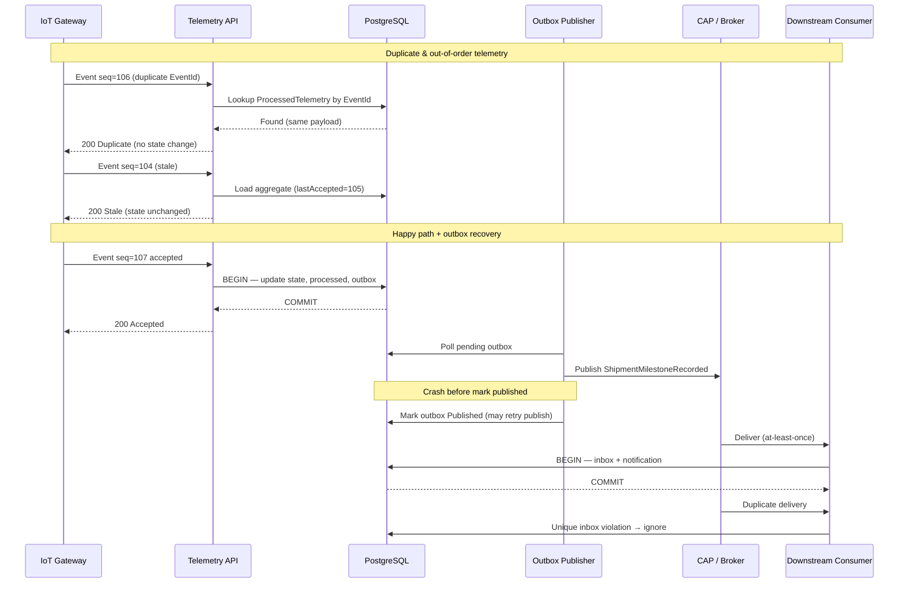

# Failure & Recovery Sequence

## Failure Scenarios

| Scenario | Expected Behavior |
|----------|-------------------|
| A — TX fails before commit | Nothing persisted |
| B — Commit OK, app crash before publish | Outbox stays pending; publisher retries |
| C — Published, crash before mark | Message may duplicate; downstream inbox dedups |
| D — Duplicate telemetry | No second milestone/outbox from same EventId |
| E — Stale telemetry | Newer operational state preserved |
| F — EventId payload conflict | Rejected; state not corrupted |
