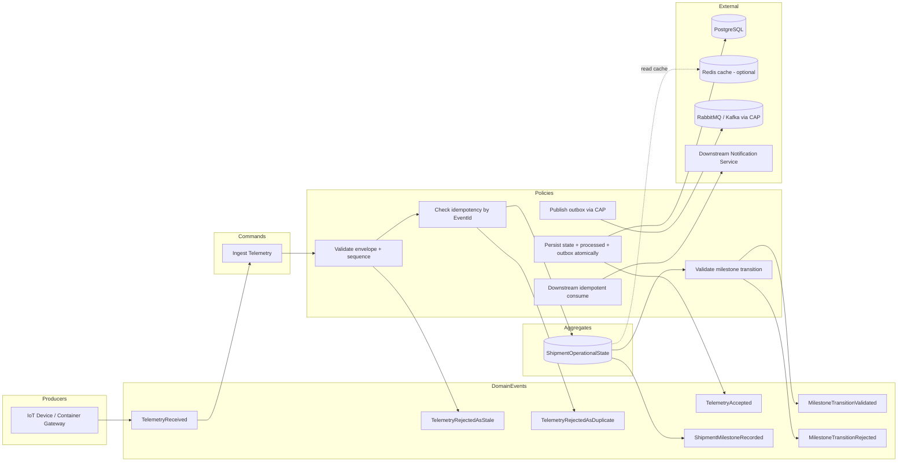

# Event Storming — Shipment Telemetry Operations

## Ubiquitous Language

| Term | Meaning |
|------|---------|
| **Telemetry Event** | Raw IoT message identified by `EventId`, ordered by per-container `SequenceNumber` |
| **Shipment Operational State** | Authoritative milestone progress for one shipment/container stream |
| **Milestone** | Business fact: ArrivedAtPort → GateIn → LoadedOnVessel → DepartedPort → GateOut |
| **Processed Telemetry** | Durable idempotency record keyed by `EventId` |
| **Outbox Message** | Integration intent written atomically with state |
| **Integration Event** | `ShipmentMilestoneRecorded` published at-least-once to downstream systems |

## Event Storming Model

## Hotspots & Decisions

| Hotspot | Decision |
|---------|----------|
| Who owns operational state? | `ShipmentOperationalState` aggregate (one row per `ShipmentId`) |
| Aggregate boundary | Shipment + container stream; milestone invariants enforced inside aggregate |
| Event ordering | `SequenceNumber` per container stream; device timestamp is informational only |
| Clock skew | Never used for ordering; stale = `sequence < lastAccepted` |
| Duplicate definition | Same `EventId` + same payload hash → duplicate |
| Payload conflict | Same `EventId` + different payload → reject/quarantine, never mutate |
| Sequence conflict | Same `(ContainerId, SequenceNumber)` + different `EventId` → reject |
| Domain vs integration events | Milestone recorded = domain event; CAP publishes integration contract |
| Replay vs new event | Replay shares existing `EventId`; dedup table prevents second business effect |

## Human-Readable Flow

1. IoT gateway posts telemetry to the API.
2. Application validates idempotency (`EventId`) and sequence ownership.
3. Aggregate loads current milestone and last accepted sequence.
4. If sequence is stale, duplicate, conflicting, or transition-invalid → observable rejection, no state mutation.
5. If sequence gap detected (in-flight lower sequence) → retry with backoff.
6. On acceptance, PostgreSQL transaction updates operational state, processed telemetry, read model, telemetry status, and outbox row.
7. Background outbox publisher delivers `ShipmentMilestoneRecorded` through CAP (RabbitMQ/Kafka).
8. Downstream consumer writes inbox + business notification in one transaction (idempotent).
